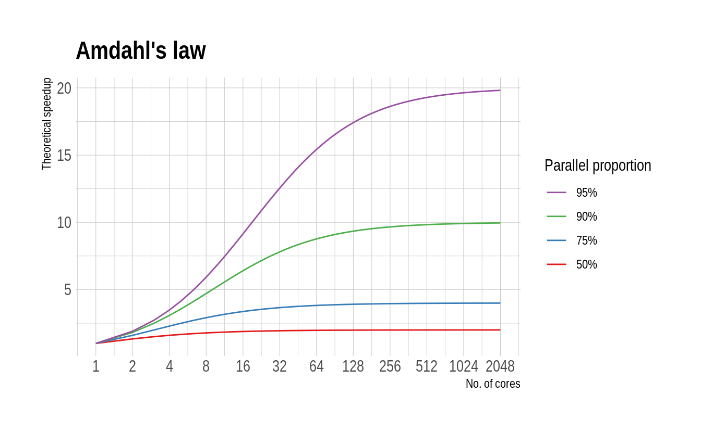

# Parallel programming {#parallel}

## Software requirements

### R packages 

- New: **parallel**, **future**, **future.apply**, **furrr**, **RhpcBLASctl**, **tictoc**
- Already used: **tidyverse**, **data.table**, **pbapply**, **memoise**, **here**, **hrbrthemes**

The code chunk below will install (if necessary) and load all of these packages for you. Note that the **parallel** package is bundled together with the base R installation and should already be on your system. We're also going to call the `future::plan()` function and set the resolution to "multisession". Don't worry what this means right now; all with be explained in due course. For the moment, simply think of it as a convenient way to set our desired parallel programming behaviour for the rest of this chapter.


```r
## Load and install the packages that we'll be using in this chapter
if (!require("pacman")) install.packages("pacman")
pacman::p_load(tictoc, parallel, pbapply, future, future.apply, tidyverse, 
               hrbrthemes, furrr, RhpcBLASctl, memoise, here)
## ggplot2 plotting theme (optional)
theme_set(hrbrthemes::theme_ipsum())

## Set future::plan() resolution strategy
plan(multisession)
```


## Prologue

Parallel programming is a big and complex topic, with many potential pitfalls. However, software innovations and some amazing new(ish) packages have made it *much* easier and safer to program in parallel in R.^[To clarify: R has provided excellent support for parallel programming for over a decade. But there's no question in our minds that the barriers to entry have recently been lowered.] With that in mind, we're going to structure this chapter back-to-front. In particular, we'll start with some motivating examples. Our primary goal is to demonstrate both the ease and immediate payoff of "going parallel". Only after convincing you of these facts will we get into some of the technical details that were abstracted away behind the scenes. The latter part of the chapter will go over parallel programming in more general terms (i.e. not R-specific) and highlight potential pitfalls that you should be aware of.

Ready? Let's go.

## Example 1: slow_square

Our first motivating example is going to involve the same `slow_square()` function that we created in Section \@ref(caching-memoisation):


```r
## Emulate slow function
slow_square = 
  function(x = 1) {
    x_sq = x^2 
    d = data.frame(value = x, value_squared = x_sq)
    Sys.sleep(2)
    return(d)
    }
```

Let's iterate over this function using the standard `lapply()` method that we're all familiar with by now. Note that this iteration will be executed in *serial*. We'll use the **tictoc** package ([link](https://cran.r-project.org/web/packages/tictoc/)) to record timing.


```r
# library(tictoc) ## Already loaded

tic()
serial_ex = lapply(1:12, slow_square)
toc(log = TRUE)
#> 24.038 sec elapsed
```


As expected, the iteration took about 24 seconds to run because of the enforced break after every sequential iteration (i.e. `Sys.sleep(2)`). On the other hand, this means that we can easily speed things up by iterating in *parallel*.

Before continuing, it's worth pointing out that our ability to go parallel hinges on the number of CPU cores available to us. The simplest way to obtain this information from R is with the `parallel::detectCores()` function:


```r
# future::availableCores() ## Another option
detectCores()
#> [1] 2
```

So, we have 2 cores to play with on this machine.^[~~A Dell Precision 5530 running Arch Linux, if you're interested.~~A cloud-based virtual machine provided by GitHub, which what we use to build this book.] Adjust expectations for you own system accordingly.

Okay, back to our example. We're going to implement the parallel iteration using the **future.apply** package ([link](https://cran.r-project.org/web/packages/future.apply/index.html)) --- more on this later. Note that the parameters of the problem are otherwise unchanged.


```r
# library(future.apply)  ## Already loaded
# plan(multisession)     ## Already set above

tic()
future_ex = future_lapply(1:12, slow_square)
toc(log = TRUE)
#> 12.24 sec elapsed
```


Look at at that: A 1× speedup! Even more impressively, consider how little the syntax changed. We just had to tell R that we wanted to implement the iteration in parallel (i.e. <code>**plan(multisession)**</code>) and slightly amend our `lapply()` call (i.e. <code>**future_**lapply()</code>). 

Let's confirm that the output is the same.


```r
all.equal(serial_ex, future_ex)
#> [1] TRUE
```

For those of you who prefer the `purrr::map()` family of functions for iteration and are feeling left out; don't worry. The **furrr** package ([link](https://davisvaughan.github.io/furrr/index.html)) has you covered. Once again, the syntax for these parallel functions will be very little changed from their serial versions. We simply have to tell R that we want to run things in parallel with `plan(multisession)` and then slightly amend our map call to <code>**future_**map_df**r**()</code>.^[In this particular case, the extra "r" at the end tells future to concatenate the data frames from each iteration by *rows*.]


```r
# library(furrr)      ## Already loaded
# plan(multisession)  ## Already set above

tic()
furrr_ex = future_map_dfr(1:12, slow_square)
toc()
#> 12.24 sec elapsed
```

How easy was that? We hardly had to change our original code and didn't have to pay a cent for all that extra performance.^[Not to flog a dead horse, but as we pointed out in the very [first lecture](https://raw.githack.com/uo-ec607/lectures/master/01-intro/01-Intro.html#26) of this course: Have you seen the price of a [Stata/MP](https://www.stata.com/statamp/) license recently? Not to mention the fact that you effectively pay *per* core...] Congratulate yourself on already being such an expert at parallel programming.


## Example 2: Bootstrapping

Our second motivating example will involve a more realistic and slightly more computationally-intensive case: Bootstrapping coefficient values for hypothesis testing.^[It's an aside, but we're strongly of the opinion that simulation methods like bootstrapping provide a far more intuitive way to understand statistics. Don't believe us? Watch John Rausser's fantastic talk: "[*Statistics Without The Agonizing Pain*](https://www.youtube.com/watch?v=5Dnw46eC-0o)". Seriously, watch it.] We'll also spend a bit more time talking about the packages we're using and what they're doing.

Start by creating a fake dataset (`d`), where we "know" that the relationship between our x and y variables. We'll then specify a bootstrapping function (`bootstrap()`) that will draw a random sample of 1,000 observations from the fake dataset (with replacement), fit a regression, and then extract the coefficient on the x variable.


```r
## Set seed (for reproducibility)
set.seed(1234)
# Set sample size
n = 1e6

## Generate a large data frame of fake data for a regression
d = data.frame(x = rnorm(n), e = rnorm(n))
## Outcome variable. Note that the x coefficient is 2.
d$y = 3 + 2*d$x + d$e

## Function that draws a sample observations from the fake dataset, then runs a 
## regression and extracts the coefficient value on the x variable.
bootstrap = 
  function(i) {
  ## Sample 1,000 rows of our fake dataset
  dsamp = d[sample.int(1e3, replace = TRUE), ]
  ## Run a regression on the sampled data, then extract the extract the x
  ## coefficient (should be around 2).
  x_coef = lm(y ~ x, dsamp)$coef['x']
  ## Return value
  return(data.frame(sim = i, x_coef = x_coef))
  }
```

### Serial implementation (for comparison)

Let's implement the bootstrap procedure in serial to get a benchmark for comparison. Note that we'll repeat the function (i.e. simulation) 10,000 times to build up a decent estimate of the parameter distribution; which, again, we know should be around 2.


```r
set.seed(123L) ## Optional to ensure that the results are the same

## 10,000-iteration simulation
tic()
sim_serial = lapply(1:1e4, bootstrap)
toc(log = TRUE)
#> 16.871 sec elapsed
```


So that took about 24 seconds on this system. Not a huge pain, but let's see if we can do better by switching to a parallel (multicore) implementation. For the record, though here is a screenshot of Grant's system monitor, showing that only one core was being used during this serial version.

> **Note:** Grant's local computer has 12 cores, which may differ from the cloud-based virtual machine that was used to build the online version of the book that you are reading.


### Parallel implemention using the **future** ecosystem

All of the parallel programming that we've been doing so far is built on top of [Henrik Bengtsson's](https://twitter.com/henrikbengtsson) amazing **future** package ([link](https://cran.r-project.org/web/packages/future/index.html)). A "future" is basically a very flexible way of evaluating code and output. Among other things, this allows you to switch effortlessly between evaluating code in _serial_ or _asynchronously_ (i.e. in parallel). You simply have to set your resolution _plan_ --- "sequential", "multisession", "cluster", etc. --- and let future handle the implementation for you.

Here's Henrik [describing](https://cran.r-project.org/web/packages/future/vignettes/future-1-overview.html) the core idea in more technical terms:

> In programming, a _future_ is an abstraction for a _value_ that may be available at some point in the future. The state of a future can either be unresolved or resolved... Exactly how and when futures are resolved depends on what strategy is used to evaluate them. For instance, a future can be resolved using a sequential strategy, which means it is resolved in the current R session. Other strategies may be to resolve futures asynchronously, for instance, by evaluating expressions in parallel on the current machine or concurrently on a compute cluster.

As we've tried to emphasise, **future** is relatively new on the scene. It is certainly not the first or only way to implement parallel processes in R. However, **future** provides a simple and unified framework that makes it (in our view) the preeminent choice. What's more, the same commands that we use here will carry over very neatly to more complicated settings involving high-performance computing clusters. We'll experience this first hand when we get to the big data section of the book.

You've probably also noted that keep referring to the "future ecosystem". This is because **future** provides the framework for other packages to implement parallel versions of their functions. The two that we'll focus on here are:

1. the **future.apply** package ([link](https://cran.r-project.org/web/packages/future.apply/index.html)), also by Henrik, and
2. the **furrr** package ([link](https://davisvaughan.github.io/furrr/index.html)), an implementation for **purrr** by [Davis Vaughan](https://twitter.com/dvaughan32).

In both cases, we start by setting the plan for resolving the future evaluation (here: `plan(multisession)`). We then call our functions --- which involve minor modifications of their serial equivalents --- and let future magic take care of everything else.

#### future.apply

Here's the `future.apply::future_lapply()` parallel implementation. Note that we're adding the `future.seed=123L` option to ensure that the results are the same. While not strictly necessary, it's always a good idea to set a random seed with simulations for the sake of reproducibility.


```r
# library(future.apply)  ## Already loaded
# plan(multisession)     ## Already set above

## 10,000-iteration simulation
tic()
sim_future = future_lapply(1:1e4, bootstrap, future.seed=123L)
toc()
#> 9.524 sec elapsed
```

Remember from our previous programming chapters that `lapply` returns a list (in this case: a list of 10,000 single row data frames). So we would have have to bind these elements together in a single, large data frame if that's what we wanted. For example,


```r
## Bind into single data frame
sim_future = do.call("rbind", sim_future)
# sim_future = dplyr::bind_rows("rbind", sim_future)       ## Another option
# sim_future = data.table::rbindlist("rbind", sim_future)  ## Another option

head(sim_future)
#>    sim   x_coef
#> x    1 2.038696
#> x1   2 1.988938
#> x2   3 1.970760
#> x3   4 1.968304
#> x4   5 2.011383
#> x5   6 2.001061
```


#### furrr

And here's the `furrr::future_map_dfr()` implementation. Similar to the above, note that we're only adding the `.options=future_options(seed=123L)` option to ensure that the output is exactly the same.


```r
# library(furrr)      ## Already loaded
# plan(multisession)  ## Already set above

## 10,000-iteration simulation
tic()
sim_furrr = future_map_dfr(1:1e4, bootstrap, .options = furrr_options(seed=123L))
toc()
#> 9.378 sec elapsed

head(sim_furrr)
#>       sim   x_coef
#> x...1   1 2.038696
#> x...2   2 1.988938
#> x...3   3 1.970760
#> x...4   4 1.968304
#> x...5   5 2.011383
#> x...6   6 2.001061
```

### Results

As expected, we dramatically cut down on total computation time by going parallel. Depending on your system, you may note that the parallel improvements for this example didn't scale linearly with the number of cores. The reason has to do with the *overhead* of running the parallel implementations --- a topic that we will revisit in Section \@ref(when-should-i-go-parallel). Once again and for the record, here is a screenshot of Grant's laptop, showing that all cores were being used during these parallel implementations.

> **Note:** Grant's local computer has 12 cores, which may differ from the cloud-based virtual machine that was used to build the online version of the book that you are reading.


While it wasn't exactly hard work, let's reward ourselves by displaying the results from our bootstrapping simulation in the form of a nice plot. We'll use the `sim_furrr` results data frame for this, although it doesn't matter since they're all the same thanks to our our random seed. As you can see, the estimated coefficient values are tightly clustered around our simulated mean of 2.


```r
sim_furrr %>%
  ggplot(aes(x_coef)) +
  geom_density(col=NA, fill="gray25", alpha=0.3) +
  geom_vline(xintercept=2, col="red") +
  labs(
    title = "Bootstrapping example",
    x="Coefficient values", y="Density",
    caption = "Notes: Density based on 10,000 draws with sample size of 10,000 each."
    )
```


### Other parallel options

Futures are not the only game in town for parallel programming in R. For example, we'll talk more about the `mclapply` function that comes bundled with base R in Section \@ref(forking-vs-sockets) below. However, one particular option that we want to mention very briefly is the **pbapply** package ([link](https://github.com/psolymos/pbapply)). As we saw in Section \@ref(aside-progress-bars), this package provides a lightweight wrapper for the `*apply` family of functions by adding a progress bar. However, the package also adds a very convenient option for multicore implementation. You basically just have to add <code>cl=CORES</code> to the call. While it doesn't rely on futures, **pbapply** also takes care of all the OS-specific overhead for you. See [here](http://peter.solymos.org/code/2016/09/11/what-is-the-cost-of-a-progress-bar-in-r.html) for an interesting discussion on what's happening behind the scenes.

You will need to run this next chunk interactively to see the progress bar. 


```r
set.seed(123) ## Optional to ensure results are exactly the same.

# library(pbapply) ## Already loaded

## 10,000-iteration simulation
tic()
sim_pblapply = pblapply(1:1e4, bootstrap, cl = parallel::detectCores())
toc()
#> 9.403 sec elapsed
```

> **Aside:** On the subject of progress bars, check out the **progressr** package ([link](https://github.com/HenrikBengtsson/progressr)) for a unified framework that works with all kinds of functions and (a)syncronous backends.

## General parallel programming topics

Motivating examples out of the way, let's take a look underneath the hood. We want to emphasise that this section is more "good to know" than "need to know". Even if you take nothing else away from rest of this chapter, you are already well placed to begin implementing parallel functions at a much larger scale.

And yet... while you don't *need* to know the next section in order to program in parallel in R, getting a solid grasp of the basics is valuable. It will give you a better understanding of how parallel programming works in general and help you to appreciate how much **future** and co. are doing behind the scenes for you. It will also help you to understand why the same code runs faster on some systems than others, and avoid some common pitfalls.

### Terminology

We'll start by clearing up some terminology.

- **Socket:** The physical connection on your computer that houses the processor. Most work and home computers --- even very high-end ones --- only have one socket and, thus, one processor. However, they can have multiple cores. Speaking of which...
- **Core:** The part of the processor that actually performs the computation. Back in the day, processors were limited to a single core. However, most modern processors now house multiple cores. Each of these cores can perform entirely separate and independent computational processes.
- **Process:** A single instance of a running task or program (R, Dropbox, etc). A single core can only run one process at a time. However, it may give the appearance of doing more than that by efficiently scheduling between them. Speaking of which...
- **Thread:** A component or subset of a process that can, *inter alia*, share memory and resources with other threads. We'll return to this idea as it applies to *hyperthreading* in a few paragraphs.
- **Cluster:** A collection of objects that are capable of hosting cores. This could range from a single socket (on your home computer) to an array of servers (on a high-performance computing network).

You may wondering where the much-referenced **CPU** (i.e. central processing unit) fits into all of this. Truth be told, the meaning of CPU has evolved with the advent of new technology like multicore processors. For the purposes of this book, we will use the following definition: 

$$\text{No. of CPUs} = \text{No. of sockets} \times \text{No. of physcial cores} \times \text{No. of threads per core}$$

If nothing else, this is consistent with the way that Linux records information about CPU architecture via the [`lscpu`](https://linux.die.net/man/1/lscpu) shell command. For example, here is what Grant sees when he runs the command on his laptop: 


```bash
lscpu | grep -E '^Thread|^Core|^Socket|^CPU\('    ## Only works on Linux
#> CPU(s):                          12
#> Thread(s) per core:              2
#> Core(s) per socket:              6
#> Socket(s):                       1
```

Note that the headline "CPU(s)" number is the same that he would get from running `parallel::detectCores()`, i.e. 12.

### A bit more about logical cores and hyperthreading

Logical cores extend or emulate the ability of physical cores to perform additional tasks. The most famous example is Intel's [**hyperthreading**](https://en.wikipedia.org/wiki/Hyper-threading) technology, which allows a single core to switch very rapidly between two different tasks. This mimics the appearance and performance (albeit to a lesser extent) of an extra physical core. You may find [this YouTube video](https://www.youtube.com/watch?v=mSZpDF-zUoI&) helpful for understanding the difference in more depth, including a nice analogy involving airport security lines.

Taking a step back, you don't have to worry too much about the difference between physical and logical (hyperthreaded) cores for the purpose of this chapter. R doesn't care whether you run a function on a physical core or a logical one. Both will work equally well. (Okay, the latter will be a little slower.) Still, if you are interested in determining the number of physical cores versus logical cores on your system, then there are several ways to this from R. For example, you can use the **RhpcBLASctl** package ([link](https://cran.r-project.org/web/packages/RhpcBLASctl/index.html)).


```r
# library(RhpcBLASctl) ## Already loaded

get_num_procs() ## No. of all cores (including logical/hyperthreaded)
#> [1] 2
get_num_cores() ## No. of physical cores only
#> [1] 2
```

### Forking vs Sockets

As we keep saying, it's now incredibly easy to run parallel programs in R. The truth is that it has actually been easy to do so for a long time, but the implementation used to vary by operating system. In particular, simple parallel implementations that worked perfectly well on Linux or Mac didn't work on Windows (which required a lot more overhead). For example, take a look at the [help documentation](https://stat.ethz.ch/R-manual/R-devel/library/parallel/html/mclapply.html) for the `parallel::mclapply()` function, which has been around since 2011. If you did so, you would see a warning that `mclapply()` *"relies on forking and hence is not available on Windows"*.

Now, we clearly didn't encounter any OS-specific problems when we ran the parallel versions of our motivating examples above. The same code worked for everyone, including anyone using Windows. ~~*Loud booing.*~~ What was happening behind the scenes is that the **future** packages automatically handled any complications for us. The parallel functions were being executed in a way that was optimized for each person's OS and R environment.

But what is "forking" and why does it matter what OS we are using anyway? Those are good questions that relate to the method of parallelization (i.e. type of cluster) that your system supports. The short version is that there are basically two ways that code can be parallelized:

- **Forking** works by cloning your entire R environment to each separate core. This includes your data, loaded packages, functions, and any other objects in your current session. This is very efficient because you don't have to worry about reproducing your "master" environment in each "worker" node. Everything is already linked, which means that you aren't duplicating objects in memory. However, forking is not supported on Windows and can also cause problems in an IDE or GUI like RStudio.^[The reason is that shared GUI elements are being shared across child processes. (See the "GUI/embedded environments" section [here](https://stat.ethz.ch/R-manual/R-devel/library/parallel/html/mcfork.html).) Combined with the fact that the shared memory is *read only*, there is a risk of "cross-contamination" where any modification made to a shared object by one of the worker nodes can propagates to the system.]
- **Parallel sockets** (aka "PSOCKs") work by launching a new R session in each core. This means that your master environment has to be copied over and instantiated separately in each parallel node. This requires greater overhead and causes everything to run slower, since objects will be duplicated across each core. Technically, a PSOCK works by establishing a network (e.g. as if you were connected to a remote cluster), but everything is self-contained on your computer. This approach can be implemented on every system, including Windows, and doesn't create problems for IDEs like RStudio. 

We've summarised the differences between the two approaches in the table below. 

Forking                                           PSOCKs
---------                                         --------
✓ Fast and memory efficient.                      × Slower and more memory-intensive (than forking).
× Only available for Unix-based systems.          ✓ Works on every operating system, incl. Windows.
× Potentially unstable in an IDE like RStudio.    ✓ Fine to use in an IDE like RStudio.

The general rule of thumb is PSOCKs are safer and more universal than forking. This makes them a good default, even if they do come with a potential performance/memory penalty. And, indeed, this is exactly what we did by selecting the **`plan(multisession)`** resolution strategy. So, now you know where that choice came from.

At the same time, however, we recommend that you consider forking if it is available to you (i.e. you're on Linux or Mac) and you want to maximize performance. In these cases, the solution requires two simple tweaks: 

1. Change your resolution plan to **`plan(multicore)`**, and
2. Run your R script from the terminal using, say, `$ Rscript -e 'rmarkdown::render("mydoc.Rmd", "all")'` or `$ Rscript myfile.R`.

Here's a very simple illustration, using the same setup as Example 1 from earlier.


```r
plan(multicore) ## NB: Only works on Unix!

tic()
future_ex_mc = future_lapply(1:12, slow_square)
toc(log = TRUE)
#> 12.128 sec elapsed
```


Here we see that invoking the forked parallel backend (i.e. `plan(multicore)`) is indeed faster than the PSOCK equivalent (i.e. `plan(multisession)`). But remember: _Caveat emptor_.

For more on forks vs PSOCKS, take a look at the [relevant section](https://github.com/HenrikBengtsson/future#asynchronous-futures) of the **future** README.

## Explicit vs implicit parallelization

Thus far we have only been concerned with *explicit* parallelization. As in, we explicitly told R to run a particular set of commands in parallel. But there is another form of *implicit* parallelization that is equally important to be aware of. In this case, certain low-level functions and operations are automatically run in parallel regardless of whether we "told" R to do so or not. Implicit parallelization can make a big difference to performance, but is not the default behaviour in R. So it has to enabled first (for example, by the package that you're using). Moreover, combining explicit and implicit parallelization can cause problems if you don't take certain precautions. Let's take a look at where implicit parallelization enters the fray.

### BLAS/LAPACK

Did you ever wonder how R and other programming languages perform their calculations? For example, how does R actually do things like vector addition, or scalar and matrix multiplication? The answer is [**BLAS**](http://www.netlib.org/blas/) (**B**asic **L**inear **A**lgebra **S**uprograms). BLAS are a collection of low-level routines that provide standard building blocks for performing basic vector and matrix operations. These routines are then incorporated in related libraries like [**LAPACK**](http://www.netlib.org/lapack/) (**L**inear **A**lgebra **Pack**age), which provide their own routines for solving systems of linear equations and linear least squares, calculating eigenvalues, etc. In other words, BLAS and LAPACK provide the linear algebra framework that supports virtually all of statistical and computational programming 

R ships with its own BLAS/LAPACK libraries by default. These libraries place a premium on stability (e.g. common user experience across operating systems). While the default works well enough, you can get *significant* speedups by switching to more optimized libraries such as the [Intel Math Kernel Library (MKL)](https://software.intel.com/en-us/mkl) or [OpenBLAS](https://www.openblas.net/). Among other things, these optimized BLAS libraries support multi-threading. So now you are using all your available computer power to, say, solve a matrix.

You can use the `sessionInfo()` command to see which BLAS/LAPACK library you are using.

### Beware resource competition

While this all sounds great --- and we certainly recommend taking a look at MKL or OpenBLAS --- there is a potential downside. In particular, you risk competing with yourself for computational resources (i.e. memory) if you mix explicit and implicit parallel calls. For instance, if you run explicit multicore functions from within R on a system that has been configured with an optimized BLAS. As [Dirk Eddelbuettel](http://dirk.eddelbuettel.com/) succinctly puts it in [this Stack Overflow thread](https://stackoverflow.com/a/18291826):

> There is one situation you want to avoid: (1) spreading a task over all _N_ cores and (2) having each core work on the task using something like OpenBLAS or MKL with all cores. Because now you have an _N_ by _N_ contention: each of the N task wants to farm its linear algebra work out to all _N_ cores.

Now, we should emphasise that nested parallelism has rarely caused major problems in our own experience. We both use optimized BLAS libraries, run explicit parallel calls all the time in our R scripts, and have only occasionally run into issues. Moreover, when these slowdowns have occurred, the impact appears to have been relatively modest.^[The major cost appears to be the unnecessary duplication of objects in memory.] Still, we have heard of cases where the effect is much more dramatic (e.g. [here](https://stat.ethz.ch/pipermail/r-sig-hpc/2014-February/001846.html)). Consider yourselves forewarned so as to be forearmed.

With that admonishment in mind, thankfully there is a an easy and relatively costless solution: Simply turn off BLAS multithreading. It turns out this has a negligible impact on performance, since most of the gains from optimized BLAS are actually coming from improved math vectorisation, not multi-threading.^[Detailed discussion here: https://blog.revolutionanalytics.com/2015/10/edge-cases-in-using-the-intel-mkl-and-parallel-programming.html] You can turn off BLAS multithreading for the current R session with the `RhpcBLASctl::blas_set_num_threads()` function. For example, we sometimes include the following line at the top of an R script:

```r
# blas_get_num_procs() ## If you want to find the existing number of BLAS threads
RhpcBLASctl::blas_set_num_threads(1) ## Set BLAS threads to 1 (i.e. turn off multithreading)
```

Since this is only in effect for the current R session, BLAS multithreading will be restored when we restart R.^[We could also reinstate the original behaviour in the same session by running `blas_set_num_threads(parallel::detectCores())`.] You can turn off BLAS multithreading as the default mode by setting an appropriate environment variable. We'll see an example of this in Section \@ref(mkl).

### Library source code

Implicit parallelization is automatically invoked by many of the external libraries that we use in R. The good news is that package developers normally take pains to avoid potential resource competition. For instance, consider the message that **data.table** greets us with at load time.


```r
library(data.table, warn.conflicts = FALSE)
```

```
#> data.table 1.14.0 using 6 threads (see ?getDTthreads).  Latest news: r-datatable.com
```

If you follow the suggestion and look at the `?getDTthreads` help documentation, you'll find an informative (and reassuring) discussion of its approach here:

> `data.table` automatically switches to single threaded mode upon fork (the mechanism used by `parallel::mclapply` and the `foreach` package). Otherwise, nested parallelism would very likely overload your CPUs and result in much slower execution. As data.table becomes more parallel internally, we expect explicit user parallelism to be needed less often...

A final point on this topic, riffing off the quoted text, is that packages like **data.table** implement their parallel operations at the source-code level, i.e. in C(++) and other compiled languages. So they are likely to be more efficient than the equivalent explicit parallel calls that you might make. It's not that you can't combine, say, **future** and **data.table** (we both do this often). But you should know that trying to do better than the latter's default operations may be a fool's errand.


## Miscellaneous

### When should I go parallel?

The short answer is that you want to invoke the multicore option whenever you are faced with a so-called "[embarrassingly parallel](https://en.wikipedia.org/wiki/Embarrassingly_parallel)" problem. You can click on that link for a longer description, but the key idea is that these computational problems are easy to break up into smaller chunks. You likely have such a case if the potential code chunks are independent and do not need to communicate in any way. Classic examples include bootstrapping (since each regression or resampling iteration is drawn independently) and Markov chain Monte Carlo (i.e. [MCMC](https://en.wikipedia.org/wiki/Markov_chain_Monte_Carlo)).

Having said that, there are limitations to the gains that can be had from parallelization. Most obviously, there is the [computational overhead](https://en.wikipedia.org/wiki/Overhead_(computing)) associated with splitting up the problem, tracking the individual nodes, and then bringing everything back into a single result. This can be regarded as an issue largely affecting shorter and smaller computations. In other words, the overhead component of the problem tends to diminish in relative size as the overall computation time increases. 

On the opposite end of the spectrum, there is [Amdahl's law](https://en.wikipedia.org/wiki/Amdahl%27s_law) (generalised as [Gustafson's law](https://en.wikipedia.org/wiki/Gustafson%27s_law)). This formalises the intuitive idea that there are diminishing returns to parallelization, depending on the proportion of your code that can be run in parallel. A case in point is Bayesian MCMC routines, which typically include a fixed "burn-in" period regardless of how many parallel chains are being run in parallel.



### How many cores should I use?

If you look this question up online, you'll find that most people recommend using `detectCores()-1`. This advice stems from the idea that you probably want to reserve one core for other tasks, such as running your web browser or word processor. While we don't disagree, both of us typically use *all* available cores for our parallel computations. For one thing, we do most of our heavy computational work on a dedicated work station or in the cloud. Keeping some computational power in reserve doesn't make sense in these cases. Second, when we are working locally, we've gotten into the habit of closing all other applications while a parallel function is running. Your mileage may vary, though. (And remember the possible diminishing returns brought on by Amdahl's law).  FWIW, calling `plan(multisession)` or `plan(multicore)` automatically default to using all your cores. You can change that by running, say, `plan(multisession(workers = detectCores()-1))`.

### Fault tolerance (error catching, caching, etc.)

One of the worst thing about parallel computation is that it is very sensitive to failure in any one of its nodes. An especially frustrating example is the tendency of parallel functions to ignore/hide critical errors up until the very end when they are supposed to return output. ("Oh, so you encountered a critical error several hours ago, but just decided to continue for fun anyway? Thanks!") Luckily, all of the defensive programming tools that we practiced in Chapter \@ref(funcs-adv) --- catching user errors and caching intermediate results --- carry over perfectly to their parallel equivalents. Just make sure that you use a persistent cache.

> **Challenge:** Prove this to yourself by running a parallel version of the cached iteration that we practiced in Section \@ref(caching-memoisation). Specifically, you should recreate the `mem_square_verbose()` function from that section, which in turn relies on the `mem_square_persistent()` function.^[To clarify: The verbose option simply provides helpful real-time feedback to us. However, the underlying persistent cache location --- provided in this case by `mem_square_persistent()` --- is necessary whenever you want to use a memoised function in the futures framework.] You should then be able to run `future_map_dfr(1:10, mem_square_verbose)` and it will automatically return the previously cached results. After that, try `future_map_dfr(1:24, mem_square_verbose)` and see what happens.

### Random number generation

Random number generation (RNG) can become problematic in parallel computations (whether trying to ensure the same of different RNG across processes). R has various safeguards against this and future [automatically handles](https://www.jottr.org/2017/02/19/future-rng/) RNG via the `future.seed` argument. We saw an explicit example of this in Example 2 above.

### Parallel regression

A number of regression packages in R are optimized to run in parallel. For example, the superb **fixest** package ([link](https://lrberge.github.io/fixest/)) that we saw in the chapter on regression analysis will automatically invoke multicore capabilities when fitting high dimensional fixed effects models. The many Bayesian packages in R are also all capable of --- and, indeed, expected to --- fit regression models by running their MCMC chains in parallel. For example, **RStan** ([link](https://mc-stan.org/rstan/articles/rstan.html#running-multiple-chains-in-parallel)). Finally, you may be interested in the **partools** package ([link](https://cran.r-project.org/web/packages/partools/index.html)), which provides convenient aliases for running a variety of statistical models and algorithms in parallel.

### CPUs vs GPUs

Graphical Processing Units, or GPUs, are specialised chipsets that were originally built to perform the heavy lifting associated with rendering graphics. It's important to realise that not all computers have GPUs. Most laptops come with so-called [integrated graphics](https://www.laptopmag.com/articles/intel-hd-graphics-comparison), which basically means that the same processor is performing both regular and graphic-rendering tasks. However, gaming and other high-end laptops (and many desktop computers) include a dedicated GPU card. For example, the Dell Precision 5530 that Grant is writing this book on has a [hybrid graphics](https://wiki.archlinux.org/index.php/hybrid_graphics) setup with two cards: 1) an integrated Intel GPU (UHD 630) and 2) a discrete NVIDIA Quadro P2000.

So why are we telling you this? Well, it turns out that GPUs also excel at non-graphic computation tasks. The same processing power needed to perform the millions of parallel calculations for rendering 3-D games or architectural software, can be put to use on scientific problems. How exactly this was discovered involves an interesting backstory of supercomputers being built with Playstations. (Look it up.) But the short version is that modern GPUs comprise *thousands* of cores that can be run in parallel. Or, as our colleague [David Evans](http://econevans.com/) once memorably described it to me: "GPUs are basically just really, really good at doing linear algebra."

Still, that's about as much as we want to say about GPUs for now. Installing and maintaining a working GPU setup for scientific purposes is a much more complex task. (And, frankly, overkill for the vast majority of econometric or data science needs.) We will revisit the topic when we get to the machine learning section of the book.^[Advanced machine learning techniques like [deep learning](https://blog.rstudio.com/2018/09/12/getting-started-with-deep-learning-in-r/) are particularly performance-dependent on GPUs.] Thus, and while the general concepts carry over, everything that we've covered in this chapter is limited to CPUs.

### Monitoring multicore performance

Bash-compatible shells should come with the built-in `top` command, which provides a real-time view of running processes and resource consumption. (Pro-tip: Hit "1" to view processes across individual cores and "q" to quit.) An enhanced alternative that we really like and use all the time is [**htop**](https://hisham.hm/htop/), which is available on both Linux and Mac. (Windows users can install `htop` on the WSL that we covered way back in the [shell lecture](https://raw.githack.com/uo-ec607/lectures/master/03-shell/03-shell.html#windows).). It's entirely up to you whether you want to install it. Your operating system almost certainly provides built-in tools for monitoring processes and resource usage (e.g. [System Monitor](https://wiki.gnome.org/Apps/SystemMonitor)). However, we wanted to flag `htop` before we get to the big data section of the course. We'll all be connecting to remote Linux servers at that point and a shell-based (i.e. non-GUI) process monitor will prove very handy for tracking resource use.

## Further resources

- Dirk Eddelbuettel provides the authoritative reference on this topic in his review paper, [*Parallel Computing With R: A Brief Review*](https://doi.org/10.1002/wics.1515) ([pre-print](https://arxiv.org/pdf/1912.11144)).
- Beyond Dirk's article, we'd argue that the starting point for further reading should be the **future**  vignettes ([one](https://cran.r-project.org/web/packages/future/vignettes/future-1-overview.html), [two](https://cran.r-project.org/web/packages/future/vignettes/future-2-output.html), [three](https://cran.r-project.org/web/packages/future/vignettes/future-3-topologies.html), [four](https://cran.r-project.org/web/packages/future/vignettes/future-4-issues.html), [five](https://cran.r-project.org/web/packages/future/vignettes/future-5-startup.html)). There's a lot in there, so feel free to pick and choose.
- Similarly, the [furrr package vignette](https://davisvaughan.github.io/furrr/index.html) is very informative (and concise).
- The [parallel package vignette](https://stat.ethz.ch/R-manual/R-devel/library/parallel/doc/parallel.pdf) provides a very good overview, not only its own purpose, but of parallel programming in general. Particular attention is paid to the steps needed to ensure a stable R environment (e.g. across operating systems).
- Finally, there a number of resources online that detail older parallel programming methods in R (`foreach`, `mclapply`, `parLapply` `snow`, etc.). While these methods have clearly been superseded by the future package ecosystem in our view, there is still a lot of valuable information to be gleaned from understanding them. Two of our favourite resources in this regard are: [How-to go parallel in R](http://gforge.se/2015/02/how-to-go-parallel-in-r-basics-tips/) (Max Gordon) and [Beyond Single-Core R](https://github.com/ljdursi/beyond-single-core-R) (Jonathan Dursi).
